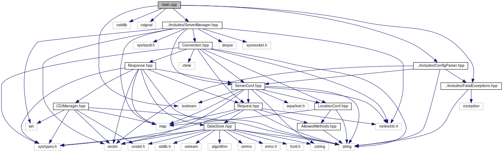
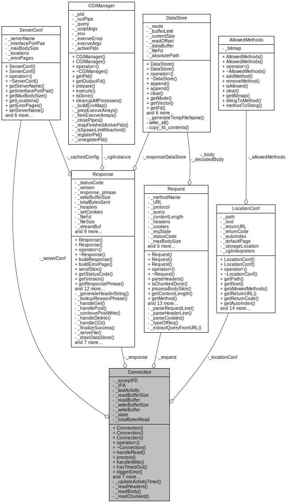

*This project was created as part of the 42 curriculum by Yaman Alrifai, Hamzah Beliah, and Yousef Kitaneh.*

---

**Table of Contents**
- [Description](#description)
- [Instructions](#instructions)
  - [Building and Running](#building-and-running)
  - [Dependencies](#dependencies)
  - [Configuration File](#configuration-file)
    - [Syntax Rules](#syntax-rules)
    - [Server Block](#server-block)
    - [Location Block](#location-block)
    - [CGI Configuration](#cgi-configuration)
- [Resources](#resources)
  - [Documentation](#documentation)
  - [Tests](#tests)
  - [Informational](#informational)
  - [Tools](#tools)
  - [AI Usage](#ai-usage)
- [Contributing](#contributing)

# Description
LeftHookRoll is a simple HTTP server implemented in C++. \
It is fully HTTP/1.0 compliant and supports the methods `GET`, `POST`, and `DELETE`, as well as dynamic CGI scripting functionality.\
The server operates on a single thread while still being fully non-blocking, achieving 100% availability on siege \
through the use of I/O multiplexing via `epoll()` and a stateful concurrency machine.

(complete documentation available through Doxygen, see [Documentation section](#documentation) \



*the dependency graph for main.cpp, generated using Doxygen*


*the class relationship diagram for the `Connection` class, the beefiest class in our project*

# Instructions

## Building and Running
At the root of the project, run:

```bash
    make
    ./server [config_file]
```

Additional `make` commands:

```bash
    make \
        clean       # removes object files
        fclean      # removes object files and executables
        re          # clean rebuild of project
        docs        # generates documentation using Doxygen
        docs-clean  # removes generated documentation
```

Details and syntax for writing the conf file are covered in [Configuration File section](#configuration-file). A sample conf file is provided in `examples/confs`.
In addition to that, an `autoconf.sh` script is provided to guide you through the process of setting up a configuration file.

## Dependencies
- a C++98 compiler
- a system that supports `epoll()` (Linux 🐧) \
*optional*:
- `doxygen` for generating documentation
- `graphviz` for generating system graphs in documentation

## Configuration File

The server is configured via a text file following Nginx-inspired syntax.

### Syntax Rules
- **Blocks** are enclosed in curly braces `{}`. Everything lives inside a `server` block.
- **Directives** end with a semicolon `;`.
- **Comments** start with `#` and extend to the end of the line.
- **Whitespace** is ignored (spaces, tabs, newlines).

### Server Block

```nginx
server {
    # server directives here
}
```

| Directive | Syntax | Example |
|-----------|--------|---------|
| `listen` | `listen <port>;` or `listen <ip>:<port>;` | `listen 8080;` / `listen 127.0.0.1:8080;` |
| `server_name` | `server_name <name>;` | `server_name example.com;` |
| `client_max_body_size` | `client_max_body_size <size>;` | `client_max_body_size 10M;` |
| `error_page` | `error_page <code> <path>;` | `error_page 404 /errors/404.html;` |
| `location` | `location <path> { ... }` | `location /api { ... }` |


**`client_max_body_size` suffixes:** `k`/`K` (kilobytes), `m`/`M` (megabytes), `g`/`G` (gigabytes). Plain number = bytes.

### Location Block

Defined inside a `server` block. Matched by longest-prefix against the request URL.

```nginx
location /path {
    # location directives here
}
```

| Directive | Syntax | Example |
|-----------|--------|---------|
| `root` | `root <path>;` | `root /var/www/html;` |
| `methods` | `methods <METHOD> [METHOD ...];` | `methods GET POST DELETE;` |
| `autoindex` | `autoindex <on\|off>;` | `autoindex on;` |
| `index` | `index <file>;` | `index index.html;` |
| `upload_store` | `upload_store <path>;` | `upload_store /var/www/uploads;` |
| `return` | `return <code> <url>;` | `return 301 https://new-site.com;` |
| `cgi_interpreter` | `cgi_interpreter <path> <.ext>;` | `cgi_interpreter /usr/bin/python3 .py;` |

### CGI Configuration

CGI is configured per-location using the `cgi_interpreter` directive. Each directive maps a file extension to an interpreter binary. Multiple `cgi_interpreter` directives can be specified in a single location block to support different script types.

```nginx
server {
    listen 8080;
    server_name localhost;
    client_max_body_size 1M;

    error_page 404 /errors/404.html;
    error_page 500 /errors/500.html;

    location / {
        root /var/www/html;
        methods GET;
        index index.html;
        autoindex off;
    }

    location /uploads {
        root /var/www;
        methods GET POST DELETE;
        upload_store /var/www/uploads;
    }

    location /cgi-bin {
        root /var/www;
        methods GET POST;
        cgi_interpreter /usr/bin/python3 .py;
        cgi_interpreter /usr/bin/perl .pl;
        cgi_interpreter /bin/sh .sh;
    }

    location /old-page {
        return 301 https://new-site.com/new-page;
    }
}
```

# Resources

## Documentation

Doxygen-generated documentation is available. To generate it, run `make docs` at the root of the project.\
Generated documentation will be located in `docs/doxygen/html/index.html`. It includes detailed descriptions \
of the server's architecture, design decisions, and implementation details, \
as well as system graphs generated using Graphviz.

## Tests

A suite of tests is provided in the `tests` directory, to run:

```bash
./tests/tester.sh [help|standard|valgrind]
```

## Informational

The most helpful resources we used:
- [Beej's Guide to Network Programming](https://beej.us/guide/bgnet/)
- [HTTP 1.0 RFC](https://datatracker.ietf.org/doc/html/rfc1945)
- [HTTP in depth](https://cs.fyi/guide/http-in-depth)
- [CGI RFC](https://datatracker.ietf.org/doc/html/rfc3875)
- [Understanding epoll](https://copyconstruct.medium.com/the-method-to-epolls-madness-d9d2d6378642)
- [Mozilla's HTTP docs](https://developer.mozilla.org/en-US/docs/Web/HTTP/Reference)
- [nginx conf file syntax](https://nginx.org/en/docs/beginners_guide.html#conf_structure) (as inspiration)

## Tools

 - `siege` for load testing and benchmarking the server's performance.
 - [Draw.io](https://app.diagrams.net/) was used to collaborate on the specification and design of the server.
 - github was used for version control, code review, and project management.
- `doxygen` and `graphviz` were used to generate real-time documentation and system graphs.
## AI Usage

AI was used to assist and speed up the code-writing process. To ensure quality and resilient code, testing suites and a rigorous code review process were put in place; no code was written without at least 2 human eyes reviewing it.\
AI was also used to *proofread* docs such as this document (;  \
Architectural design and code structure were all human efforts.

# Contributing

Although this project was created for educational purposes, contributions and questions are welcome. If you have any suggestions or questions, feel free to open an issue, submit a pull request, or reach out. The code standards we followed are detailed [here](docs/contributing_guidelines.md).